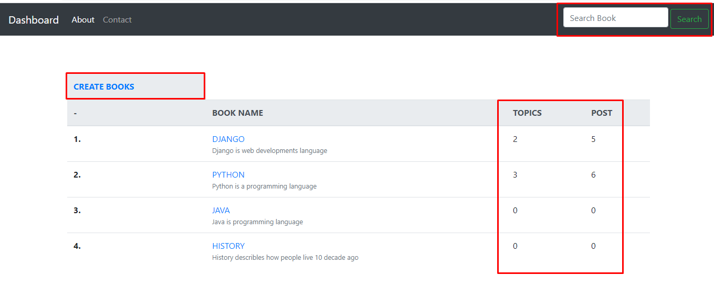
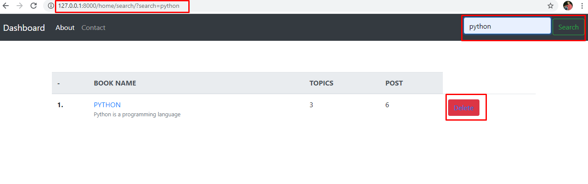
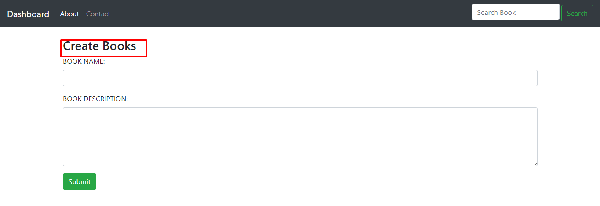
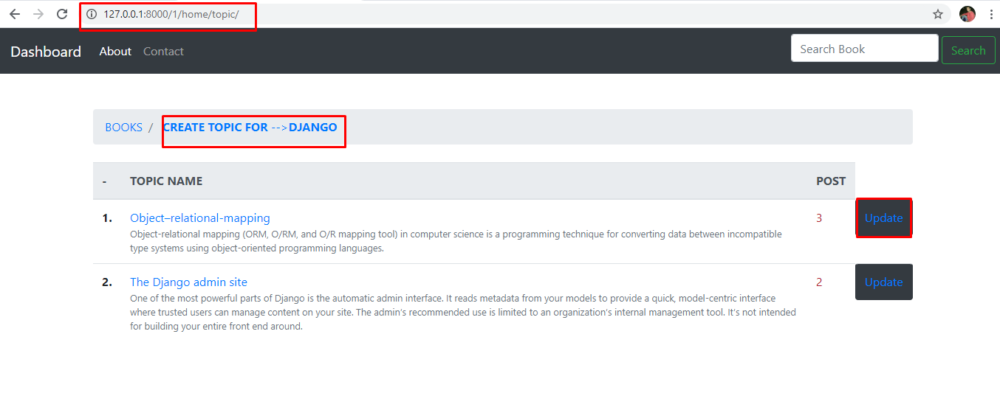
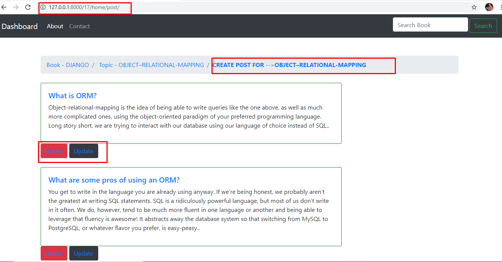
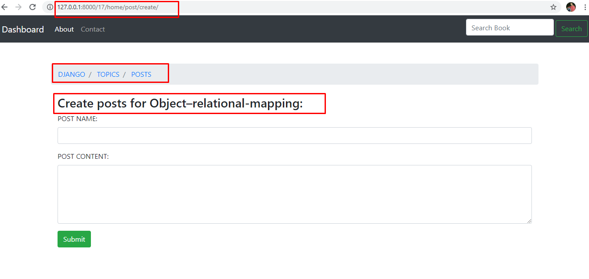
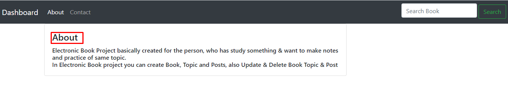

## Book Electronic Book Project basically created for the person, who has study something &amp; want to make notes and practice of same topic.             In Electronic Book project you can create Book, Topic and Posts, also Update &amp; Delete Book Topic &amp; Post

### run project: Python manage.py runserver -->  http://127.0.0.1:8000/

### Home Page

 
-------------------------------------------------------------------------------------------------------------------------------------------------------------------

### Search Book and also Delete Book

-------------------------------------------------------------------------------------------------------------------------------------------------------------------

### Create Book

-------------------------------------------------------------------------------------------------------------------------------------------------------------------

### All Topics of Same Book

-------------------------------------------------------------------------------------------------------------------------------------------------------------------

### All Posts

-------------------------------------------------------------------------------------------------------------------------------------------------------------------

### Create Post

-------------------------------------------------------------------------------------------------------------------------------------------------------------------

### About us

